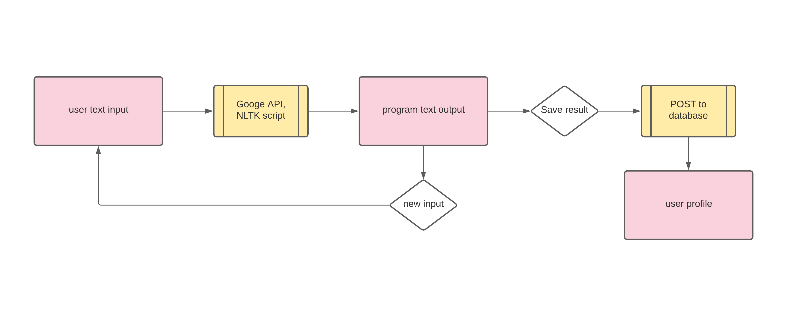
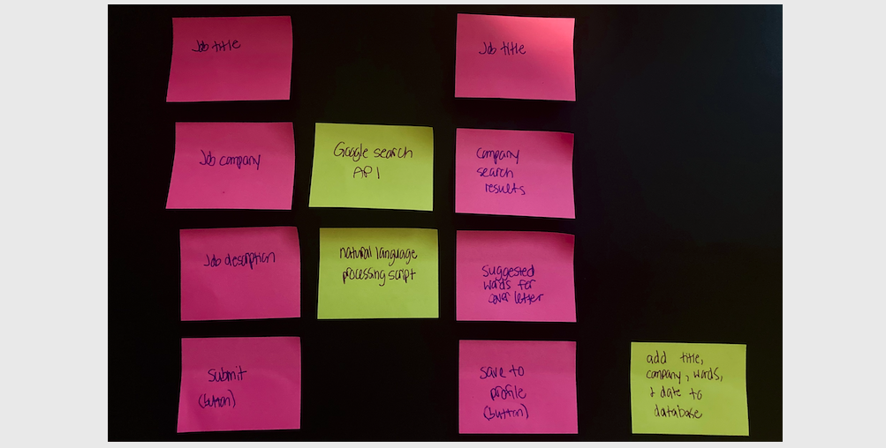
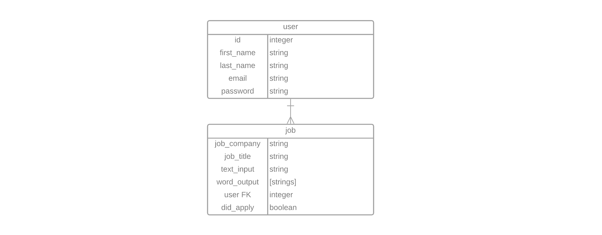

# Cover Letter Inspo

Cover letters are becoming more prominent in the job hunt across all industries. An effective cover letter often involves additional research on the company itself and also careful reading of the job description. Using natural language processing, Cover Letter Inspo provides word suggestions for your cover letter based on the job description.

## Tech stack

Django, Python, React

## User flows

As a user, I want to:
- input any text job description and receive a list of suggested words to include in my cover letter for said company/job
  - example: copy and paste description from LinkedIn posting
- input company name and receive a list of Google search results related to the company
- have an option to save the job title, original description and suggestion words to my profile
- log in to profile to view past results

Below shows the frontend (pink) and backend (yellow) interactions, from left (input) to right (output)

## Wireframes

## Entity Relationship Diagram

## Natural language processing

- To filter the job desciption, [Natural Language Toolkit](https://www.nltk.org/) will be used for text analytics in Python, including tools such as word tokenization, frequency distribution and stopword removal

## MVP goals

- return 30-50 word suggestions based on text job description input from user
- save job title, job company, job description and word suggestions to user profile in database
- achieve total functionality of React frontend interactions with Django backend

### Stretch goals

- use [Google Custom Search API](https://developers.google.com/custom-search/v1/overview) to show company search results
